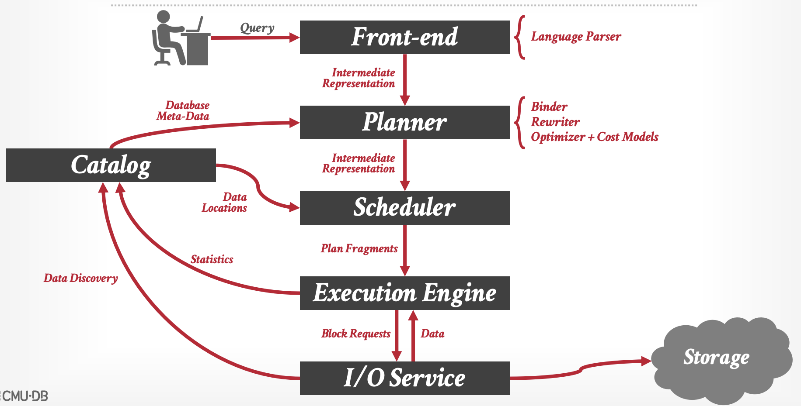

# Catalog

* Zilong Zhou (zilongz@andrew.cmu.edu)
* Yen-Ju Wu (yenjuw@andrew.cmu.edu)
* Chien-Yu Liu (chienyul@andrew.cmu.edu)

## Overview
### Goal
The goal of this project is to design and implement a **Catalog Service** for an OLAP database system. The Catalog aims for managing metadata and providing a centralized repository for storing information about the structure and organization of data within the OLAP database. This project aims to produce a functional catalog that adheres to [the Iceberg catalog specification](https://iceberg.apache.org/spec/) exposed through [REST API](https://github.com/apache/iceberg/blob/main/open-api/rest-catalog-open-api.yaml).
## Architectural Design
We follow the logic model described below. The input of our service comes from execution engine and I/O service. And we will provide metadata to planner and scheduler. We will use [pickleDB](https://docs.rs/pickledb/latest/pickledb/) as the key-value store to store (namespace, tables) and (table_name, metadata) as two (key, value) pairs as local db files.
We will use [Rocket](https://rocket.rs) as the web framework handling incoming API traffic.

### Data Model
We adhere to the Iceberg data model, arranging tables based on namespaces, with each table uniquely identified by its name.
For every namespace in the database, there are associated list of tables.
For every table in the catalog, there are associated metadata, including statistics, version, table-uuid, location, last-column-id, schema, and partition-spec.
The parameters for request and response can be referenced from [REST API](https://github.com/apache/iceberg/blob/main/open-api/rest-catalog-open-api.yaml). We directly import Iceberg-Rust as a starting point.

### Use Cases
#### Namespace
create/delete/rename namespace
#### Table
create/delete/rename table 
#### Query Table’s Metadata (including statistics, version, table-uuid, location, last-column-id, schema, and partition-spec)
get metadeta by {namespace}/{table}

## Design Rationale
* Correctness:
  * The catalog service ensures data consistency and correctness by adhering to the Iceberg Catalog REST interface.
  * Data durability mechanisms will be implemented to prevent data loss during restarts.
* Performance:
  * Optimization on data retrieval and storage strategies to minimize latency in metadata access.
* Engineering Complexity / Maintainability:
  * Centralized metadata management achieved by separating data and metadata, reducing complexity and facilitating consistent metadata handling.
  * Code modularity and clear interfaces facilitate easier updates and improvements.
  * We adopt the existing kvstore ([pickleDB](https://docs.rs/pickledb/latest/pickledb/)) and server ([Rocket](https://github.com/rwf2/Rocket)) to mitigate the engineering complexity.
* Testing:
  * Comprehensive testing plans cover correctness through unit tests and performance through long-running regression tests. Unit tests focus on individual components of the catalog service, while regression tests evaluate system-wide performance and stability.
* Other Implementations:
  * Chose the Iceberg Catalog REST interface due to its industry adoption, standardization, and compatibility with various systems.

## Testing Plan
To ensure the quality and the performance of the catalog implemented, a comprehensive testing strategy is a must. Our testing strategy will include both functional and non-functional aspects of our catalog service. 

* Functional testing
  * API tests: For functional testing, we can achieve the goal through unit tests. We will test each API endpoint implemented in our project to ensure correct behavior. We will test various input parameters and validate the response format and the status code are as expected. Also, we will try to mimic possible edge cases and errors to ensure the implementation is robust and can perform suitable error handling. By doing so, we can ensure the API works as expected and provides correct results to clients. 
  * Metadata tests: We will focus on verifying the correct storage and retrieval of metadata. Tests will include different scenarios, including some edge cases. [Quickcheck](https://github.com/BurntSushi/quickcheck) is an example for performing the testing.
  * [Documentation tests](https://doc.rust-lang.org/rustdoc/write-documentation/documentation-tests.html#documentation-tests): Execute document examples 
* Non-functional testing
  * Microbenchmarking for performance evaluation: We can use [Criterion.rs](https://github.com/bheisler/criterion.rs?tab=readme-ov-file#features) and [bencher](https://github.com/bluss/bencher) to collect statistics to enable statistics-driven optimizations. In addition, we can set up a performance baseline to compare the performance with our implementation. We can measure different metrics, for example, response time, throughput, etc.  
  * Scalability test: We will try to test our implementation under increased load and ensure the correctness and efficiency at the same time.

## Trade-offs and Potential Problems
* Balancing between metadata retrieval speed and storage efficiency.
* Balancing between query performance and engineering complexity/maintainability (such as adding bloom filters).

## Glossary (Optional)
>If you are introducing new concepts or giving unintuitive names to components, write them down here.
