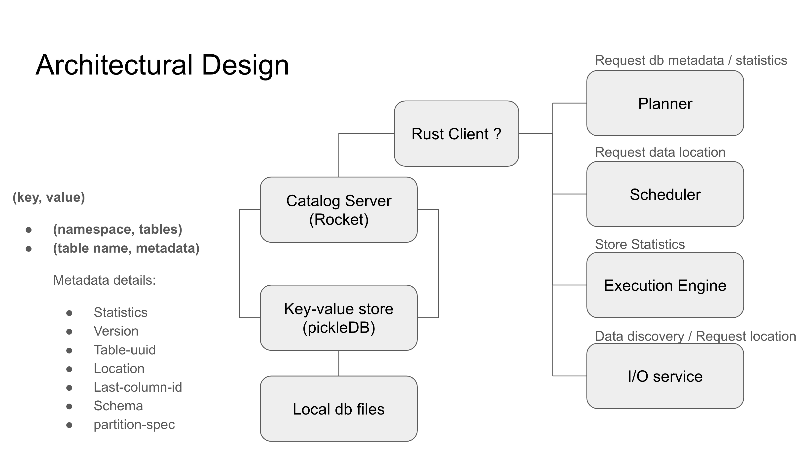

# Catalog

* Zilong Zhou (zilongz@andrew.cmu.edu)
* Yen-Ju Wu (yenjuw@andrew.cmu.edu)
* Chien-Yu Liu (chienyul@andrew.cmu.edu)

## Overview
### Goal
The goal of this project is to design and implement a **Catalog Service** for an OLAP database system. The Catalog aims for managing metadata and providing a centralized repository for storing information about the structure and organization of data within the OLAP database. This project aims to produce a functional catalog that adheres to [the Iceberg catalog specification](https://iceberg.apache.org/spec/) exposed through [REST API](https://github.com/apache/iceberg/blob/main/open-api/rest-catalog-open-api.yaml).
## Architectural Design
We follow the logic model described below. The input of our service come from execution engine and I/O service. And we will provide matadata to planner and scheduler.

### Data Model
We adhere to the Iceberg data model, arranging tables based on namespaces, with each table uniquely identified by its name. Our goal is to enable multi-versioning, facilitating point-in-time queries and allowing for queries at a specific historical version of the table.

For every table in the catalog, there is an associated metadata file. This file contains a collection of manifests, each of which references the table's information at different points in time. The manifest file is an in-memory, non-persistent component that gets recreated based on on-disk files during service restarts. (If it is not frequently updated, we could dump it to disk every time we update it)

To enhance startup and recovery times, we periodically save the in-memory index to disk. This ensures a quicker restoration process by utilizing the dumped index data.

### Use Cases
#### Namespace
create/update/delete namespace. 
#### Table
create/update/delete table 
#### Query Table’s Metadata
get metadeta by {namespace}/{table}

## Design Rationale
>Explain the goals of this design and how the design achieves these goals. Present alternatives considered and document why they are not chosen.

## Testing Plan
>How should the component be tested?

## Trade-offs and Potential Problems
>Write down any conscious trade-off you made that can be problematic in the future, or any problems discovered during the design process that remain unaddressed (technical debts).

## Glossary (Optional)
>If you are introducing new concepts or giving unintuitive names to components, write them down here.